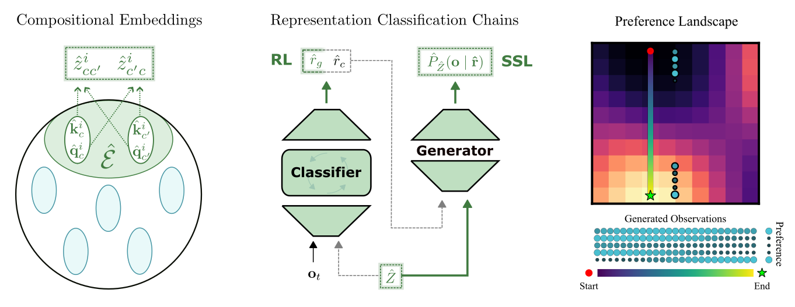
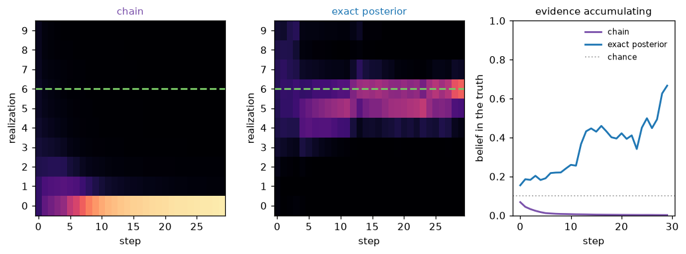
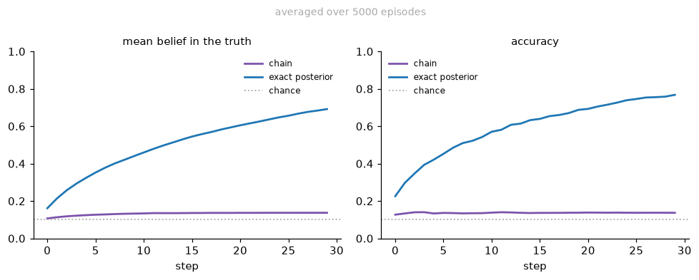
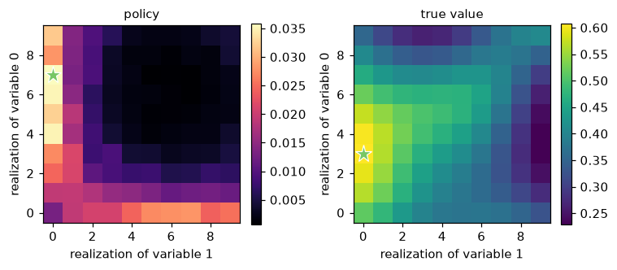
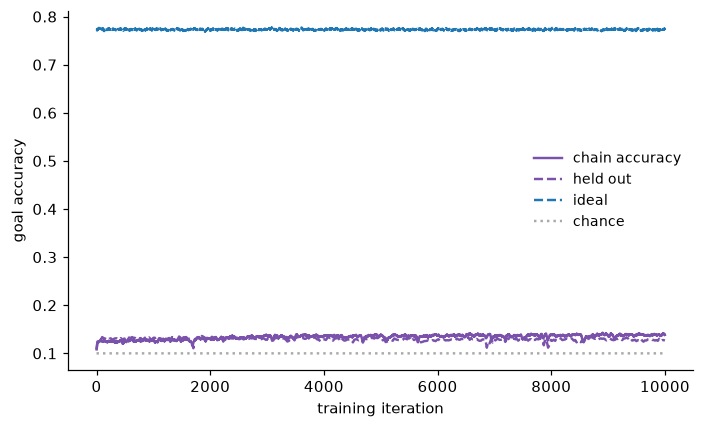
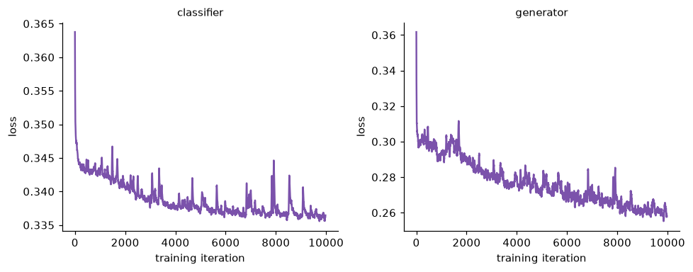

# rcc

PyTorch modules implementing **Representation Classification Chains**, the
architecture from *Factorization Regret mediates compositional generalization in
latent space* ([arXiv:2603.27134](https://arxiv.org/abs/2603.27134)).

A chain separates what the world is *made of* from what is happening *right
now*. One pathway learns how latent variables interact, trained only by how well
it predicts observations. A second reads that representation to infer which
variables are currently active and what values they hold. The two share a
forward pass and no gradient.



*Left: variables own key and query embeddings, contracted into the interactions
`Ẑ`. Centre: the classifier infers realizations from observations and `Ẑ`, the
generator predicts observations back from them — reward trains the first,
self-supervision the second, and the dashed arrows carry no gradient. Right: with
the interactions learned, the generator turns preferences into a landscape the
controller can climb.*

Every stage is a plain `nn.Module` that takes and returns tensors. There is no
dependency on any particular environment, and no training loop to adopt.

## Install

```bash
pip install git+https://github.com/johnschwarcz/rcc
```

For the figures, add the `viz` extra:

```bash
pip install "rcc[viz] @ git+https://github.com/johnschwarcz/rcc"
```

Requires Python 3.10+ and PyTorch 2.2+.

## Quick start

```python
import torch
from rcc import RCC, RCCConfig

cfg = RCCConfig(n_vars=50, n_contexts=2, n_realizations=4,
                n_observations=3, hidden_dim=32)
chain = RCC(cfg)

observations = torch.rand(16, 10, 3).round()      # (episodes, steps, channels)
ctx_inds = torch.randint(0, 50, (16, 2))           # which variables are active

belief, interaction = chain(observations, ctx_inds)
belief.shape        # (16, 10, 2, 4) — episodes, steps, variables, realizations
```

`belief[e, t, c, r]` is how strongly the chain believes, after `t` observations
in episode `e`, that active variable `c` has realization `r`.

## The four stages

| Stage | Module | Reads | Produces |
| --- | --- | --- | --- |
| 1. Representation | `InteractionEncoder` | `ctx_inds` | one interaction per ordered pair of active variables, per channel |
| 2. Classification | `BeliefClassifier` | observations, interactions | a belief over each active variable's realization |
| 3. Generation | `ObservationGenerator` | a realization, interactions | predicted observation rates |
| 4. Control | `Controller` | interactions | a distribution over joint realizations |

Stage 1 holds a key and a query embedding per variable per channel. Two active
variables interact through the dot product of one's key with the other's query,
and since that product is asymmetric a pair contributes two numbers rather than
one. Those numbers are all that stages 2–4 ever learn about how variables
combine.

Stage 2's readout does not emit a belief. It emits an *increment*, and the belief
is `softmax(cumsum(increments))`. A softmax over a sum of logits is a product of
likelihood ratios, so the network accumulates evidence multiplicatively while
only having to learn one step of it. Nothing forces the result to be Bayesian;
the architecture makes the Bayesian solution the easy one to represent.

## The seam

`BeliefClassifier` detaches the interactions it is given. Classification error
cannot travel back into the representation, so what the chain represents is
shaped only by how well it predicts the world — never by what happens to make
classification easier. This is a property of the gradient graph, and it is
[tested as one](tests/test_chain.py).

The parameter groups follow the same split, which is what lets each objective
have its own optimizer:

```python
estimation = torch.optim.Adam(chain.estimation_parameters(), lr=1e-3)  # stages 1, 3
inference  = torch.optim.Adam(chain.inference_parameters(),  lr=1e-3)  # stage 2
control    = torch.optim.Adam(chain.control_parameters(),    lr=1e-3)  # stage 4
```

The embeddings live in the *estimation* group, not with the classifier that
consumes them. The three groups partition the chain exactly.

## Configuration

`RCCConfig` is frozen and validated on construction. Field names match
[coggrid](https://github.com/johnschwarcz/coggrid), so the two can be read side
by side.

| Field | Default | Meaning |
| --- | --- | --- |
| `n_vars` | `500` | Size of the latent variable pool. Stage 1 holds one key and one query embedding per variable per channel. |
| `n_contexts` | `2` | Number of simultaneously active latent variables. Drives the controller's action space, which is `n_realizations ** n_contexts`. |
| `n_realizations` | `10` | Number of discrete values each active variable can take. |
| `n_observations` | `5` | Number of binary observation channels. |
| `embedding_dim` | `30` | Dimensionality of the key/query embeddings that are contracted into interactions. |
| `hidden_dim` | `1000` | Width of every hidden layer, and of the recurrent state. |
| `learn_embeddings` | `True` | Whether stage 1's embeddings are learned. `False` requires you to supply them, which isolates the classifier by handing it a perfect representation. |
| `seed` | `None` | Seed for parameter initialization. `None` means non-reproducible. Seeding restores the global RNG afterwards, so it will not disturb your own stream. |

Two of coggrid's fields are deliberately absent. `n_steps` and `n_episodes` are
read from the shape of the tensor each module is handed, so storing them would
create a second source of truth that could disagree with the data.

Derived properties: `n_interactions`, `realization_shape`,
`n_joint_realizations`, `classifier_input_dim`.

## Objectives

Nothing is wired into a module. Choosing objectives is how you choose what the
chain is being asked to do.

| Function | Trains | Needs |
| --- | --- | --- |
| `supervised_loss(belief, target)` | stage 2 | a belief you already trust |
| `reward_loss(goal_belief, selection, correct)` | stage 2 | only whether the committed answer was right |
| `prediction_loss(predicted_rates, observed_rates)` | stages 1, 3 | nothing — the observations are their own target |
| `embedding_norm_penalty(keys, queries)` | stage 1 | nothing |
| `controller_loss(value, predicted_value, log_prob, entropy)` | stage 4 | a value for the action taken |

`reward_loss` is the one that makes the paper's claim testable: the chain commits
to an answer, is told only whether it was right, and that single bit is applied
to the belief in that answer at every step.

`prediction_loss` optionally takes `correct` and `chance`, which blend the
unconditional average with the average over episodes the chain got right. While
the chain is guessing, "the episodes it got right" is not a meaningful subset;
as it improves, those are the episodes whose proposed realization was worth
predicting from.

## Using your own task

The chain needs exactly two tensors, and neither carries any assumption about
where they came from:

| Argument | Shape | Meaning |
| --- | --- | --- |
| `observations` | `(n_episodes, n_steps, n_observations)` | binary observations over time |
| `ctx_inds` | `(n_episodes, n_contexts)` | which variables are active, as indices into the pool |

Anything with a pool of discrete latent variables, a stream of binary
observations, and a question about one of those variables will fit. A training
step, in full:

```python
from rcc import RCC, RCCConfig, supervised_loss

chain = RCC(RCCConfig(n_vars=50, n_contexts=2, n_realizations=4,
                      n_observations=3, hidden_dim=32))
optimizer = torch.optim.Adam(chain.inference_parameters(), lr=1e-3)

belief, interaction = chain(observations, ctx_inds)
loss = supervised_loss(belief, target_belief)
optimizer.zero_grad()
loss.backward()
optimizer.step()
```

Stages are independent modules, so you can take one without the rest:

```python
from rcc import BeliefClassifier

classifier = BeliefClassifier(cfg)
belief = classifier(observations, my_own_context_vector)
```

## The environment

Nothing in `src/rcc` imports an environment, and nothing should — the four stages
take tensors and return tensors. To *run* a chain you need a task, and the one the
paper used is [coggrid](https://github.com/johnschwarcz/coggrid): it models the
generative process properly, holds out a slice of the variable pool for testing
generalization, and ships the ideal-observer baselines.

```python
from coggrid import CogGridConfig, World, run_observers

world = World(CogGridConfig(n_vars=50, n_contexts=2, n_realizations=4,
                            n_observations=3, embedding_dim=30, n_steps=20))
batch = world.sample_episodes(128, split="train")
posterior = run_observers(batch)["joint"].belief   # the ideal observer's belief
```

`batch.ctx_inds` and `batch.observations` go straight into a chain — the names are
coggrid's and rcc keeps them — and the joint observer's belief is the target worth
distilling.
coggrid is a development dependency, installed by `pip install -e ".[dev]"` — it is
not needed to import `rcc`.



*One episode. The chain's belief and the exact posterior both concentrate as
observations arrive; the dashed line is the true realization. A single episode
can show the chain above the posterior — belief in the truth is linear in the
belief, so any estimator sharper than the posterior scores higher on it. The
comparison that means something is the average:*



*The same batch, averaged. Only the right panel is bounded by the exact observer:
`argmax` is the Bayes decision rule, so nothing can be more often right than the
posterior, while a sharper belief can and does sit above it on the left.*

## Generalization

coggrid holds a third of its variable pool back, so "a novel combination of known
variables" is something you can measure rather than assert. `make_assets.py` scores
the trained chain on both splits against both ideal observers.

The comparison worth watching is `ideal` against `naive`. The joint observer knows
the interactions; the naive one does the same inference assuming the active variables
are independent. The gap between them is the factorization regret — the part of the
task a chain can only get right by having represented the interaction structure.
Beating chance is easy, and beating `naive` is the claim.

This demonstrates the setup; it is not a replication. The paper's transfer result
comes from a reinforcement-learning run over far more episodes than the figure above,
so treat the held-out group as a baseline to improve on rather than as the result.

## Control

Stage 4 never sees an observation. It reads the interactions and, from those
alone, picks a joint realization to put the world into — one realization for
every active variable, so the policy is a distribution over a grid.

```python
from rcc import intrinsic_value

policy, predicted_value = chain.controller(interaction.score)
actions, log_prob, entropy = chain.controller.act(policy)
value = intrinsic_value(rates_of_those_actions, preferences)
```

`intrinsic_value` scores a set of observation rates against what the chain wants
to see: the geometric mean over channels of the rate where the channel is
preferred and its complement where it is not. A geometric mean, rather than a
sum, means one badly-missed channel cannot be bought back by the others.



*After a short run, the policy concentrates on the joint realization worth the
most. The star marks each panel's maximum.*

## Examples

```bash
python examples/quickstart.py    # every stage trained, in as few lines as it goes
python docs/make_assets.py       # the same run, instrumented, with every figure
```

`quickstart.py` prints nothing and plots nothing on purpose: it is the shortest path
from a world to a trained chain, so it reads as the API. `make_assets.py` is that run
with the losses recorded, the generalization table printed, and the figures below
written out.

Every task and architecture parameter is a flag, so reshaping a run never means
editing a file. `--help` lists them all:

```bash
python examples/quickstart.py --n-realizations 8 --n-contexts 3   # a bigger task
python examples/quickstart.py --hidden-dim 512                    # a wider chain
```

Task flags (`--n-vars`, `--n-contexts`, `--n-realizations`, `--n-observations`,
`--embedding-dim`) reach both the world and the chain, because the two have to be
describing the same task. `--n-steps` goes to the world alone — the chain reads the
step count off the tensor it is handed. `--hidden-dim` and `--learn-embeddings` are the
chain's alone. Run controls are `--out DIR` to save figures instead of showing them,
`--iterations N`, `--batch-size N`, `--lr X` and `--seed N`; without a seed each run
explores fresh randomness. `docs/make_assets.py` takes the same flags, plus
`--control-iterations N` and `--control-lr X` for the stage 4 run it does.

To change a default rather than pass it every time, pin it where the script parses
its arguments — `args = arguments(n_realizations=8)` — and the command line still
overrides. Each run prints the config it resolved to, so a figure is never
ambiguous about the shape that produced it.

Both train against coggrid, and say so if it is absent:

```bash
pip install git+https://github.com/johnschwarcz/coggrid
```



*The chain's accuracy against the exact observer it is distilling, and chance.
The dashed purple line is the same measurement on held-out variables, taken every
25 iterations against a fixed batch the chain never trains on.*



*The two objectives that produced it. They never touch the same parameter: the
classifier's error moves stage 2, and the generator's prediction error is the only
gradient stage 1 ever sees.*

## Development

```bash
pip install -e ".[dev]"
pytest -q
ruff check src tests examples docs conftest.py
python docs/make_assets.py    # regenerate the README figures
```

The test suite covers three things. `tests/test_reference.py` transcribes the
original implementation's arithmetic and checks every stage against it with
shared weights — a rewrite of a published architecture is worth nothing if it
quietly changed the result. `tests/test_chain.py` checks the gradient seam.
`tests/test_learning.py` trains real chains against coggrid and asserts they
improve.

## Relation to the original code

The architecture first appeared in
[CognitiveGridworld](https://github.com/johnschwarcz/CognitiveGridworld) as five
`nn.Module` mixins that passed state through instance attributes. This package
computes the same functions with explicit arguments. Three behaviours were changed
deliberately, and each is marked in `tests/test_reference.py`: the generator no
longer collapses length-one axes; the prediction loss no longer divides by zero on
a batch where nothing was answered correctly; and that loss now averages its two
terms the same way, so `chance` is a mixing weight rather than one that grew with
the number of observation channels.

## Citation

```bibtex
@article{schwarcz2026factorization,
  title  = {Factorization Regret mediates compositional generalization in latent space},
  author = {Schwarcz, John},
  year   = {2026},
  eprint = {2603.27134},
  archivePrefix = {arXiv}
}
```

## License

MIT — see [LICENSE](LICENSE).
